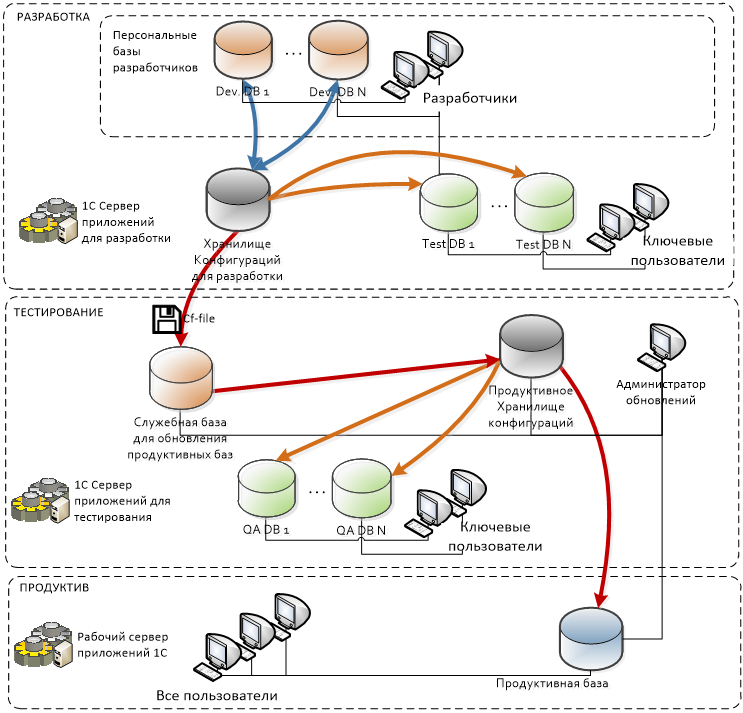

# Регламент подготовки и выпуска релизов конфигурации 1С.

## Глосарий

**Централизованное хранилище разработки (1-ое хранилище)** – база данных конфигурации, где хранятся объекты конфигурации, используется для захвата разработчиком в целях доработки (изменения) объекта в соответствии с проектным решением. К централизованному хранилищу будут подключены все базы разработки участников команды разработки.

**Продуктивное хранилище (2-ое хранилище)** – База данных конфигурации, где хранятся объекты конфигурации, используется для захвата в целях изменения тестируемого объекта, и по итогам тестирования включения в продуктив. К продуктивному хранилищу будут подключены базы продуктива, тестирования, и базы включения изменений из централизованного хранилища.

## Основные положения

1. Выпуск очередных релизов конфигурации осуществляется еженедельно по вторникам.
2. При разработке используется централизованное хранилище конфигурации для разработки.
3. К централизованному хранилищу конфигурации подключаются базы всех разработчиков, а также базы для тестирования и отладки функционала.
4. Продуктивная среда подключается к продуктивному хранилищу, которое обновляется в процессе выпуска релиза обновляется CF-файлом конфигурации, получаемым из тестового хранилища.

## Правила именования баз

### 1. Базы разработки

**DEV_<разработчик>_<сокращенное наименование базовой конфигурации/назначения базы>_<сокращенное наименование заказчика/подразделения заказчика>**

Например:
**DEV_AKuznetsov_ERP_SUPERCOMPANY** – база для разработки, разработчика AKuznetsov, на основе конфигурации ERP 2.0 клиента Super Company.
**DEV_AKuznetsov_TRES_SUPERCOMPANY** – база для разработки, разработчика AKuznetsov, конфигурации казначейства клиента Super Company.

### 2. Базы рабочего тестирования

**TST<номер>_<сокращенное наименование базовой конфигурации/назначения базы>_<сокращенное наименование заказчика/подразделения заказчика>**

Например:
**TST4_ERP_SUPERCOMPANY** – 4-я база для выполнения рабочего тестирования, на основе конфигурации ERP 2.0 клиента Super Company.
**TST2_TRES_SUPERCOMPANY** – 2-я тестовая база для выполнения рабочего тестирования конфигурации казначейства клиента Super Company.

### 3. Базы приемочного тестирования

**QA<номер>_<сокращенное наименование базовой конфигурации/назначения базы>_<сокращенное наименование заказчика/подразделения заказчика>**

Например:
**QA2_ERP_SUPERCOMPANY** – 2-я база для выполнения приемочного тестирования, на основе конфигурации ERP 2.0 клиента Super Company.
**QA5_TRES_SUPERCOMPANY** – 5-я тестовая база для выполнения приемочного тестирования конфигурации казначейства клиента Super Company.

### 4. Служебные базы для обновления продуктивного хранилища

**UPD_<сокращенное наименование базовой конфигурации/назначения базы>_<сокращенное наименование заказчика/подразделения заказчика>**

Например:
**UPD_ERP_SUPERCOMPANY** –база для выполнения обновления продуктивного хранилища, на основе конфигурации ERP 2.0 клиента Super Company.
**UPD_TRES_SUPERCOMPANY** – база для выполнения обновления продуктивного хранилища, конфигурации казначейства клиента Super Company.

### 5. Продуктивные базы

**PRD_<сокращенное наименование базовой конфигурации/назначения базы>_<сокращенное наименование заказчика/подразделения заказчика>**

Например:

**PRD_ERP_SUPERCOMPANY** – продуктивная база на основе конфигурации ERP 2.0 клиента Super Company.
**PRD_TRES_SUPERCOMPANY** – продуктивная база казначейства клиента Super Company.

### 6. Хранилище разработки

**DEV_<сокращенное наименование базовой конфигурации/назначения базы>_<сокращенное наименование заказчика/подразделения заказчика>**

Например:

**DEV_ERP_SUPERCOMPANY** – хранилище разработки на основе конфигурации ERP 2.0 клиента Super Company.
**DEV_TRES_SUPERCOMPANY** – хранилище разработки конфигурации казначейства клиента Super Company.

### 7. Продуктивное хранилище

**PRD_<сокращенное наименование базовой конфигурации/назначения базы>_<сокращенное наименование заказчика/подразделения заказчика>**

Например:

**PRD_ERP_SUPERCOMPANY** – продуктивное хранилище на основе конфигурации ERP 2.0 клиента Super Company.
**PRD_TRES_SUPERCOMPANY** – продуктивное хранилище конфигурации казначейства клиента Super Company.

## Порядок внесения изменений и обновления конфигураций

1. Завершенные разработки помещаются в Централизованное хранилище. 
2. Специалист, ответственный за функциональное тестирование измененного/добавленного функционала, выполняет обновление тестовой базы из хранилища для разработки и проводит тестирование.
3. В случае, когда тестирование выявляет неработоспособность функционала и обозначены выявленные ошибки, ответственный за тестирование оповещает об этом разработчика, разработчик исправляет и снова отдает на тестирование. Так до тех пор, пока не будут выправлены все ошибки.
4. Регулярно (раз в неделю) из хранилища для разработки выполняется выгрузка файла конфигурации (cf-файл конфигурации), который передается специалисту поддержки, ответственному за обновление продуктивной базы и списка требуемых к загрузке разработанных (измененных) объектов конфигурации.
5. Специалист поддержки:

   * Открывает в режиме конфигуратора базу для включения изменений и методом объединения осуществляет заливку измененных / разработанных объектов из полученного списка.

   * В базе для включения изменений, в режиме 1С Предприятие - Осуществляет поверхностное тестирование (открывает объект, записывает, проводит, если отчет формирует отчет) и по итогам тестирования отмечает объекты, по которым функционирует программа с ошибками.

   * Выполняет резервное копирование данных продуктивной базы

   * Выполняет сравнение конфигурации продуктивной среды с конфигурацией, полученной из хранилища для разработки.

   * В случае получения информации о наличии ошибок, затрагивающих ранее работающий функционал, отключает объединение объектов, содержащих указанные ошибки.

   * Производит объединение изменений;

## Порядок обновления базовой (типовой) конфигурации

### 1. Термины

**Старая конфигурация поставщика (СКП)** – Типовая конфигурация поставщика, на базе которой функционирует рабочая конфигурация (РК)

**Новая конфигурация поставщика (НКП)** – Типовая конфигурация поставщика, на которую необходимо обновить рабочую конфигурацию (РК)

**Рабочая конфигурация (РК)** – Текущая конфигурация, созданная путем внесения изменений в старую конфигурацию поставщика (СКП)

**Новая конфигурация (НК)** – Результат обновления рабочей конфигурации (РК) до новой конфигурации поставщика (НКП)

**Промежуточная конфигурация (ПК)** – промежуточный результат обновления, полученный путем частичного переноса изменения из новой конфигурации поставщика (НКП) (изменений относительно старой конфигурации поставщика (СКП))

**Объект** – любой элемент дерева метаданных - Справочник, Документ, Реквизит, Измерение, Форма, Макет, Команда и т.п.

### 2. Используемые базы (необходимо предварительно создать и загрузить указанные начальные конфигурации)

* База для контроля изменений (БКИ) в РК относительно СКП

* База для выявления типовых изменений (БТИ) с СКП на начальном этапе и НКП на конечном

* База для обновления (БО) с РК на начальном этапе и НК на конечном

### 3. Сравнение конфигураций и выявление изменений

Необходимо выполнить следующие сравнения конфигураций

* В базе для контроля изменений (БКИ) выполнить сравнение конфигурации поставщика (СКП) с основной конфигурацией (РК)

* В базе для выявления типовых изменений (БТИ) выполнить сравнение НКП (проверить, что разрешено удаление объектов). Для первого сравнения, необходимо выполнить обновление конфигурации, для последующих сравнение/объединение.

* В базе для обновления выполнить сравнение с НКП (проверить, что разрешено удаление объектов). Для первого сравнения, необходимо выполнить обновление конфигурации, для последующих сравнение/объединение.

### 4. Основные правила переноса изменений

* Объекты, добавленные в НКП относительно СКП, переносятся как есть (НЕОБХОДИМО ПРОКОНТРОЛИРОВАТЬ РОЛИ, добавленные в РК)

* Объекты, измененные в НКП относительно СКП, но неизменные в РК относительно СКП переносятся как есть

* Объекты, удаленные в НКП относительно СКП, удаляются

* Объекты, измененные в РК относительно СКП, но неизмененные в НКП относительно СКП остаются как есть.

* Для объектов, измененных в НКП относительно СКП, а также измененных в РК относительно СКП (дважды измененных),  перенос изменений выполняется вручную

### 5. Рекомендации по переносу изменений для 2-жды измененных объектов

#### Роли

В случае изменения состава ролей, рекомендуется выполнять их объединение (Объединить с приоритетом основной конфигурации)

#### Реквизиты

В случае изменения состава типов составного типа реквизита рекомендуется выполнить объединение типов.

#### Модули, кроме модулей форм

При объединении модулей рекомендуется проверить, где больше объем изменений (в НКП или в РК) и полностью заменить текст модуля из той конфигурации, где изменений больше, а затем перенести изменения из второй конфигурации
Также модули можно обновлять в режиме сравнения/объединения путем обновления отдельных процедур.

#### Модули форм

Модули обычных (не управляемых) форм НЕЛЬЗЯ обновлять через сравнение/объединение, только ВРУЧНУЮ.

### 6. Контроль выполнения обновления

* Для контроля выполнения обновления рекомендуется параллельно с обновлением объектов в промежуточной  конфигурации (ПК) в базе для обновления отмечать для объединения объекты в БТИ.

* В случае сложных обновлений, также рекомендуется составить список обновляемых объектов, например, в MS Excel и также отмечать объекты для которых обновление выполнено.

## Порядок выполнения обновлений продуктивной базы.

### 1. Для тестовой базы:

* Открыть базу в режиме «Конфигуратор»;

* Подключиться к хранилищу для разработки;

* Выполнить рекурсивное получение конфигурации из хранилища;

* Обновить конфигурацию информационной базы;

* Выполнить контрольный запуск базы в режиме «1С: Предприятие»;

* Выполнить контрольные процедуры указанные разработчиками в описании изменений;

* **В случае возникновения ошибок при контрольном запуске или выполнении контрольных процедур, процесс обновления завершить и оповестить разработчиков о возникших ошибках!**

* Выгрузить конфигурацию в файл по адресу:

  * Файлы выгрузки должны именоваться в соответствии с шаблоном: <имя хранилища тестовой конфигурации>-<номер релиза>.cf;
  * Файл выгружается 1 раз, т.е. если несколько тестовых баз подключены к одному хранилищу, то файл конфигурации нужно выгрузить только из одной (любой) базы;

* Закрыть «1С: Предприятие» и конфигуратор.

### 2. Для служебной базы, для обновления рабочего хранилища

* Открыть базу в режиме «Конфигуратор»;

* Подключиться к рабочему хранилищу;

* Выполнить сравнение и объединение с соответствующим файлом выгрузки конфигурации;
  * В диалоге сравнения и объединения нажать на кнопку «Настройка», установить флаг «Разрешить удаление объектов», нажать «Ок»;
  * Снять и установить флаг объединения у корневого объекта конфигурации;
  * В случае получения информации о наличии ошибок, затрагивающих ранее работающий функционал, снять флаг объединения для объектов, содержащих указанные ошибки.

* Обновить конфигурацию информационной базы;

* Рекурсивно поместить конфигурацию в хранилище.

### 3. Для тестовой (QA) базы, подключенной к рабочему хранилищу

* Открыть базу в режиме «Конфигуратор»;

* Подключиться к рабочему хранилищу;

* Выполнить рекурсивное получение конфигурации из хранилища;

* Обновить конфигурацию информационной базы;

* Выполнить контрольный запуск базы в режиме «1С: Предприятие»;

* Выполнить контрольные процедуры указанные разработчиками в описании изменений;

* В случае возникновения ошибок при контрольном запуске или выполнении контрольных процедур, процесс обновления завершить и оповестить разработчиков о возникших ошибках;

### 4. Для рабочей базы:

* Проверить наличие резервной копии информационной базы;

* Открыть базу в режиме «Конфигуратор»;

* Подключиться к рабочему хранилищу;

* Выполнить рекурсивное получение конфигурации из хранилища;

* Обновить конфигурацию информационной базы;

* Выполнить контрольный запуск базы в режиме «1С: Предприятие»;

* Выполнить контрольные процедуры указанные разработчиками в описании изменений;

* В случае возникновения ошибок при контрольном запуске или выполнении контрольных процедур, выполнить восстановление информационной базы из резервной копии средствами SQL Server на момент времени до выполнения обновления конфигурации информационной базы и оповестить разработчиков о возникших ошибках;
  * Закрыть «1С: Предприятие» и конфигуратор.
  * Процесс обновления завершен.

 
## Приложение 1. Параметры подключения информационных баз к хранилищам конфигураций

1. Сервер хранилища для разработки: <имя сервера> (<IP-адрес сервера>)
2. Сервер рабочего (продуктивного) хранилища: <имя сервера> (<IP-адрес сервера>)
3. Имя пользователя хранилища совпадает с именем подключенной базы (исключения указаны в таблице)
4. Пароль пользователя хранилища 

* Для тестовых баз: 

* Для служебной базы для обновления: 

* Для рабочих баз: 

| № Конфигурация | Хранилище конфигурации для разработки | Тестовые базы (сервер\имя базы (Имя пользователя в хранилище, если отличается от имени базы)) | Хранилище рабочей (продуктивной) конфигурации | Тестовые (QA) базы, подключенные к рабочему хранилищу (сервер\имя базы) | Рабочие базы (сервер\имя базы) |
|-|-|-|-|-|-|
|1.|-|-|-|-|-|
|2.|-|-|-|-|-|
|3.|-|-|-|-|-|
|4.|-|-|-|-|-|
